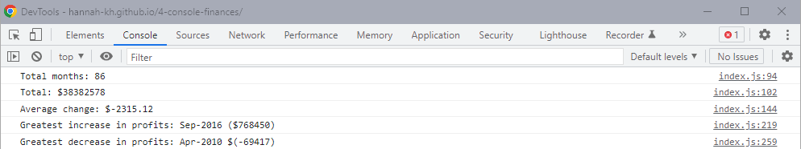

# 4-console-finances
## Description

The purpose behind this project was to print data to the console using Javascript based on the dataset provided. The 5 data items were:
1. The total number of months included in the dataset.

2. The net total amount of Profit/Losses over the entire period.

3. The average of the changes in Profit/Losses over the entire period.
  
4. The greatest increase in profits (date and amount) over the entire period.

5. The greatest decrease in losses (date and amount) over the entire period.

## Installation

N/A

## Usage

[Deployed application](https://hannah-kh.github.io/4-console-finances/).

Inspect the page to view the console and the figures.

## Credits

N/A

## License

Refer to the LICENSE in the repo.

---